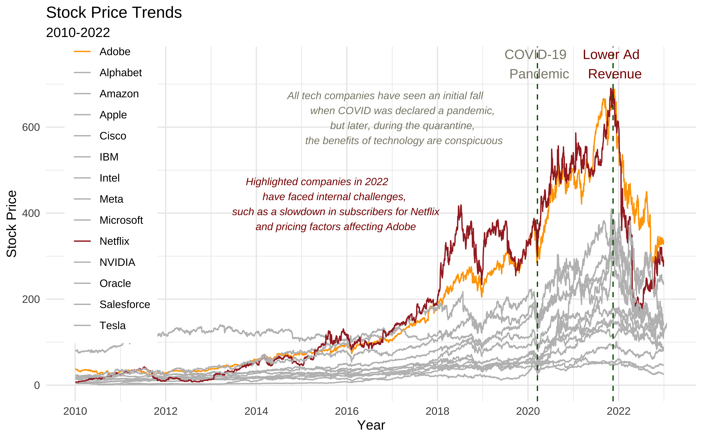
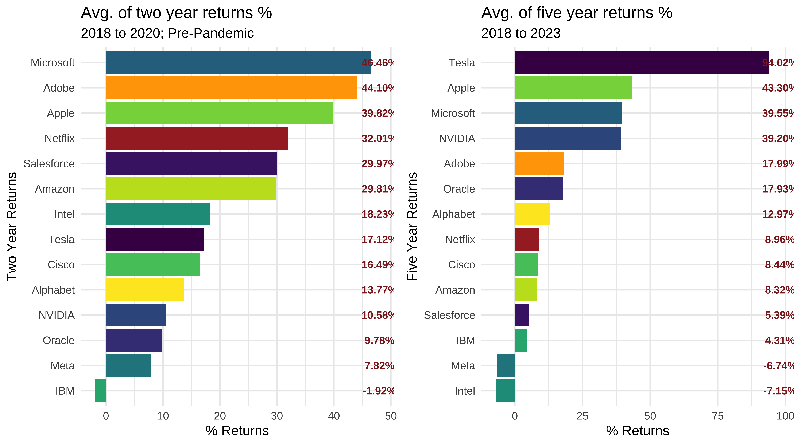
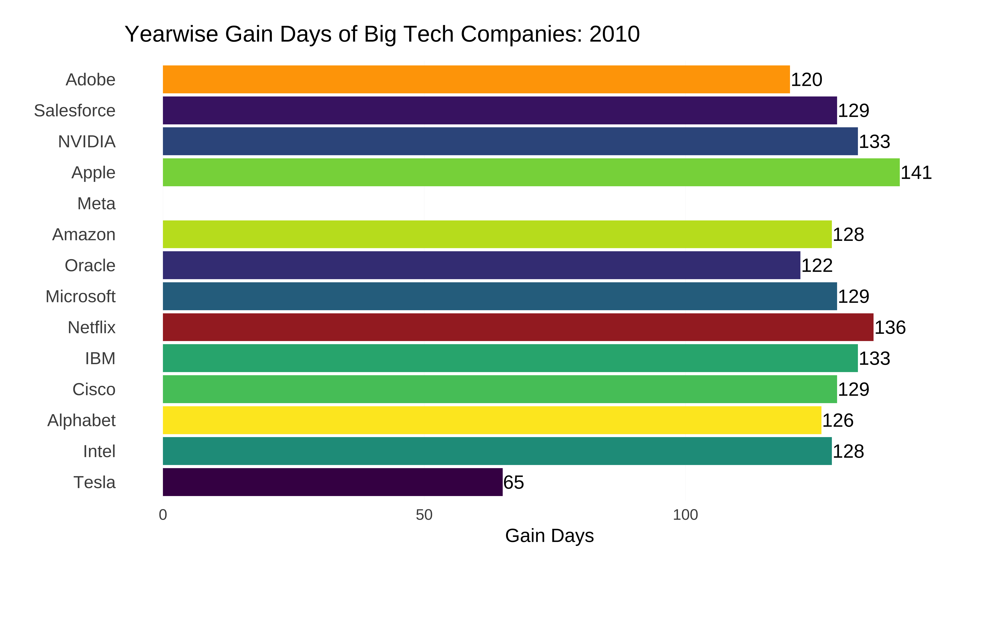
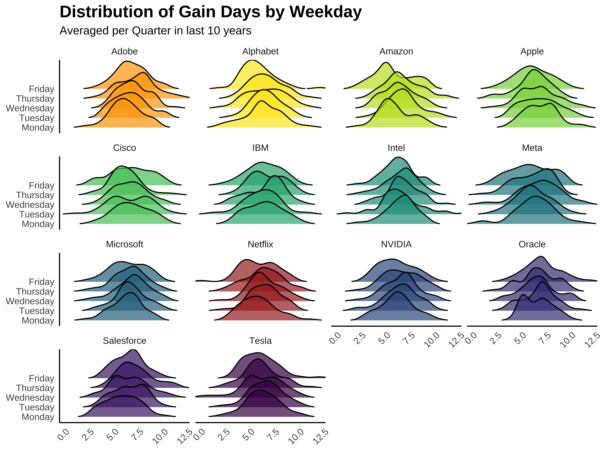

# Uncovering Big tech stock prices between 2010 and 2022

This project analyzes stock price patterns of major tech companies between 2010 and 2022, with a particular focus on the impact of significant events like COVID-19. The goal is to explore stock price trends and provide insights into how different companies reacted to market events over time. Using advanced data visualization techniques, the project highlights key trends and returns, making it a valuable tool for decision-making and strategic planning.

For a more detailed exploration of the project, you can visit the original project site [Uncovering Big Tech Stock Prices](https://info-526-s24.github.io/project-01-Crimson/).

## Overview

This data visualization project is dedicated to uncovering patterns within the stock prices of major tech companies over the past decade, with a particular focus on understanding the impact of significant events such as COVID-19. Employing visualization techniques like bar plots and line plots, the project serves as a vital tool for interpreting the dynamics of stock prices. In its second phase, the project provides a nuanced exploration of stock price trends across financial quarters and weekdays, offering stakeholders valuable insights for decision-making and strategic planning. The dataset, originating from the TidyTuesday project, spans 12 years and encompasses 14 leading technology companies, providing a rich source for comprehensive analysis of various aspects of the stock market. It's worth noting that, given limitations in accessing broader economic indicators, the project refrains from establishing causality and instead focuses on observing trends and returns as key indicators.

## Key Questions Addressed
## 1. Which companies have experienced the highest/lowest impact on their stock prices due to the pandemic?

In this section, project delve into a comprehensive examination of overall stock price trends, specifically focusing on `adj_close` values spanning from 2010 to 2022. The analysis considers key variables, including `adj_close`,`date`, and `stock_symbol` to gain insights into trends across various companies. Special attention is given to the pre and post-COVID periods, offering a detailed understanding of the pandemic's impact on major tech companies. The approach involves utilizing three types of plots: two line plots and one bar plot. The visualizations aim to illustrate overall trends, de-trended patterns, and returns over specific periods, providing a nuanced perspective on how major tech companies navigated these critical timeframes.

### Stock Price Trends

### Stock Price De-trending graph between 2018 and 2022

### Two year and five year returns

### Conclusions

Throughout the analysis, the impact of the pandemic on stock prices reveals distinctive winners and losers. Netflix and Adobe notably suffered substantial declines in 2022 due to post-Covid-19 effects, including a sales slowdown, recession fears, internal factors and rising unemployment rates. Conversely, Apple, Microsoft, and IBM demonstrated resilience, remaining relatively unaffected by the trend reversal in 2022. A closer look at long-term trends positions Apple, Telsa, and Microsoft as standout gainers, while Tesla emerges as a clear winner with the highest 5-year returns, surging from 17% to an impressive 94%. This comprehensive overview highlights the varying degrees of impact and success among the analyzed companies during this period.

## 2. What patterns do we see in the positive gain days over the given period?

In this question, our focus shifts to a detailed analysis of gain-day patterns across various companies over a 12-year period. The gain_days variable is computed by comparing opening and closing prices on the same day, categorizing days as gains (1) or no gains (0) based on the closing being higher than the opening. Key variables include date and stock_symbol. The analysis holds significance for trading strategies, particularly in determining optimal entry and exit points. By incorporating weekdays, the examination gains depth, enabling insights into favorable trading days. Two distinct plots are employed: a column plot illustrating overall gain-days for each company on a yearly basis, and a ridge plot analyzing gain-days grouped by quarter and weekday. The visualizations offer a comprehensive understanding of gain-day patterns, aiding traders in making informed decisions. The integration of yearly trends and weekday analyses provides a holistic perspective on trading dynamics over the 12-year period

### Animated bar plot of positive gain days

### Distribution of Gain Days by Weekday

### Conclusions

In our earlier analysis, companies with higher returns were identified. Now, considering different positive gain days across weekdays, short-term investors can strategically align with historical performance. For instance, Tesla, with higher returns, may be a target for buying on Monday and Tuesday, selling on Tuesday. In contrast, IBM, with lower returns, could be bought on Thursday and sold on Wednesday. This approach optimizes trading strategies by incorporating both return patterns and positive gain day distributions. Empowering traders with these insights, along with considering the potential volatility, these graphs serve as valuable tools for day and weekly trading strategies, facilitating quick gains in the dynamic stock market landscape.

## Primary Dataset used

### `big_tech_stock_prices.csv`

| variable       | class     | description                                                                                                                                                                                                                       |
|----------------|-----------|-----------------------------------------------------------------------------------------------------------------------------------------------------------------------------------------------------------------------------------|
| `stock_symbol` | character | stock_symbol                                                                                                                                                                                                                      |
| `date`         | double    | date                                                                                                                                                                                                                              |
| `open`         | double    | The price at market open.                                                                                                                                                                                                         |
| `high`         | double    | The highest price for that day.                                                                                                                                                                                                   |
| `low`          | double    | The lowest price for that day.                                                                                                                                                                                                    |
| `close`        | double    | The price at market close, adjusted for splits.                                                                                                                                                                                   |
| `adj_close`    | double    | The closing price after adjustments for all applicable splits and dividend distributions. Data is adjusted using appropriate split and dividend multipliers, adhering to Center for Research in Security Prices (CRSP) standards. |
| `volume`       | double    | The number of shares traded on that day.                                                                                                                                                                                          |

### `big_tech_companies.csv`

| variable     | class     | description               |
|--------------|-----------|---------------------------|
| stock_symbol | character | stock_symbol              |
| company      | character | Full name of the company. |

## Team Members
This project was originally developed as part of a group effort for INFO 526 - Data Analysis and Visualization at the University of Arizona. The original contributors to the project were: Arun, Varun, Jasdeep, Mohit, Pradnya.

## Resources used:

TidyTuesday Data - [Big Tech Stock Prices](https://github.com/rfordatascience/tidytuesday/tree/master/data/2023/2023-02-07)

